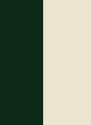
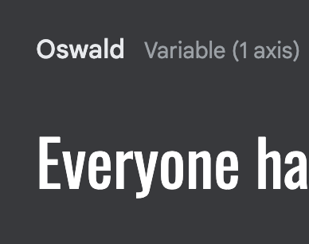
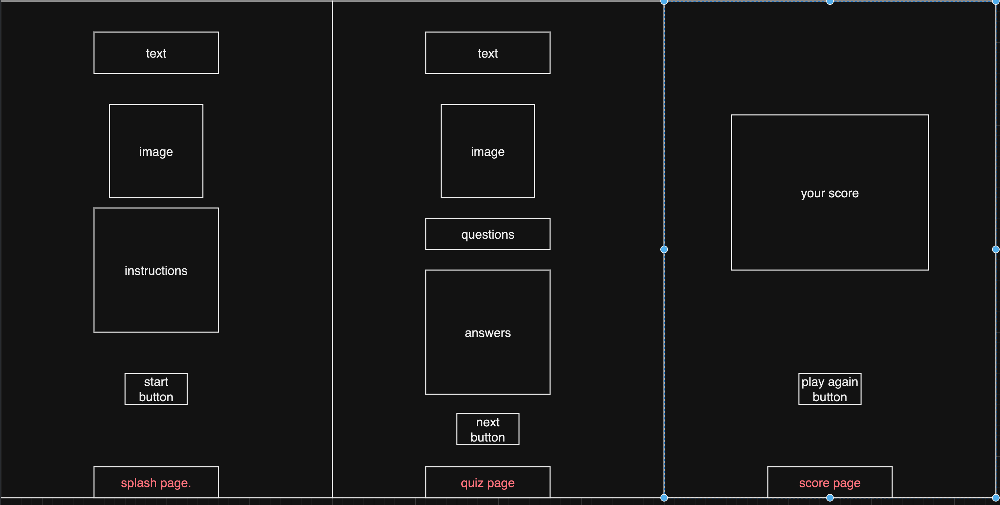
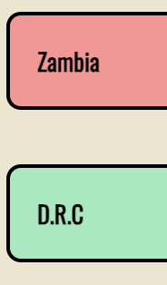
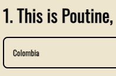
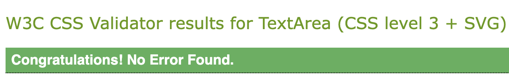
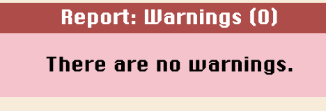
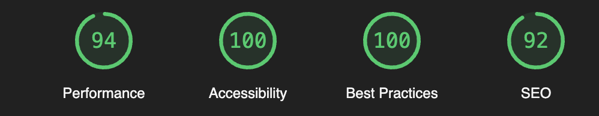
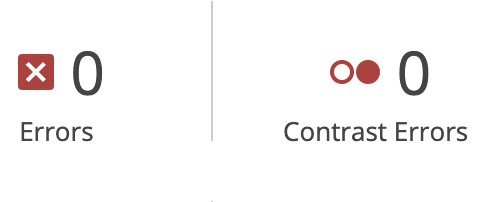

# National Dishes Quiz

link to deployed site: https://alessandr095.github.io/National-Dishes/

This is my PP2 javascript project for my Diploma in Full Stack software development at Code Institute.

This is a quiz based application created with JavaScript and HTML and styled with CSS.

This is a multiple choice quiz. with a splash page, instuctions, randomised questions and answers to keep repeat users playing.

It is mobile first coded, so it is reponsive across all platforms.

## Target Audience.

Anyone that would like to test the knowledge on food from around the world

## User Stories.

A site for someone to test there general knowledge.

A easy representation of how the basis of JS works, easy to visualise the code for new coders, from loops to variables to functions, to different scopes.

## Design.

### General Structure.

- All colours and shades throughout the website are harmonious, with a deep earthy and green tones.
- A sans-serif font has been used to have the quiz be more approachable and easy to read for people with disabilities.
  
### Colour Palette

The colour palette i went with was an off white and british racing green, two colours that compliment but are not too in your face, and give good visability.

### Typography. 

I used Oswald, because of it's readability, and that it does not get lost on a white background.

### Wire Frame.

consistancy throughout the website makes the user navigate with ease.

## Features.

- Splash page.

![splash](assets/images/splashpage.webp

- the splash page is the landing page for the quiz, its give the user brief instructions on how the quiz works and a start button that causes a function of hiding the splash page and taking the user to the quiz page.
  
-  Quiz Page. 
  
  

- the quiz page consists of randomised question and answers set with functions. 
- the answer buttons also highlight and transition from off white to black with a funtion and css. 
- it consists of functions that hide the next button, stop the user from being able to click after selecting an answer and sets a style in CCS that shows colour for incorrect or correct answer through an if statement, and tallies up the score through a function that is displayed at the end, in the score page.

- Score Page.
  
   
  
  - The score page consists of the score tally, that calculated the correct answers a users has got through a function in the answer buttons. 
  - it also consists of and play again button that has function that calls the splash page to reappear, thus restarting the game on a randomised question, for replayability.
  
  ### Testing.

  - Test was done before deployment to see if everything in the DOM was acting correctly.
  - While hosting on gitpages multiple platform were used to test the functionality and responsitivity of the quiz. such as Safari, Firefox and Google Chrome were use.
  - Multiple devices were used to run the quiz, such as iphone 13 mini, iphone 14 pro max, ipad air, macbook and windows laptop running Google Chrome, all peformed as expected.
  - all internal links are working. 
  - all aspect are in their respective files, such as index.html, css files, the javascript file, and the question javascript file. all are linked and working as expected.
  
  ### Bugs.

  - I came across no major bugs while testing, just a responsive problem that was sorted out with a media query.
  
  ### Validator Testing.

  - HTML
  

  No errors during testing the HTML code through W3C validator.

  - CSS
    
  

    No errors during testing CSS code through Jigsaw validator.

  - JavaScript
    
    
    
    No errors in jslint, just a few missing semi colons that were fixed before running the source code through jslint.

    - LightHouse Peformance.

    
    
    - Wave Peformance.

    
    
    accessability and visability is all up to code. no contrast errors.
    
 ### Technologies and Languages used.
    
- Github - used for repositories and deployment of website through github pages.
- Codeanywhere - IDE used for writing code.
- HTML - Language used for structure of website.
- CSS - Language used for styling the structure of the website.
- JavaScript - Language used for the script, used to make the site less static with more function.
- Font Awesome - Used for custom fonts within the website such as website links.
- Google Fonts - used for typography throughout the website.
- lightHouse - used to test site peformance.
- Wave - used to test visability and accessability.
- WC3 - used for validators of markdown symantics and CSS through jigsaw

### Unfixed Bugs. 

- No unfixed bugs.

### Deployment.

  National Dishes Quiz is deployed on GitHub Pages.

- Steps to deploy
- Navigate to the settings tab.
- Got to source section and select master branch.
- Once the master branch is selected the site will be live.
- Live link to Husk can be found here: https://alessandr095.github.io/National-Dishes/

### Credits.

- JavaScript code and how to impliment and question and answer function and general basis on how to create a quiz came from YouYube Channel: GreatStack. Video: <https://www.youtube.com/watch?v=PBcqGxrr9g8>
- JavaScript understanding and implimentation for randomising the questions and answers and start button came from a family friend, Luke Van
