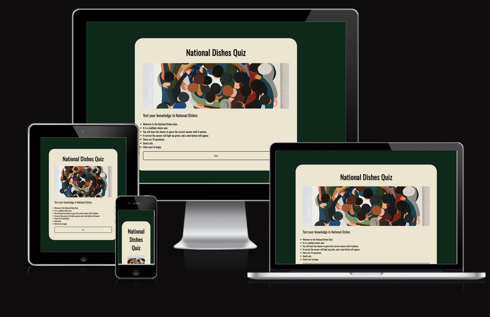

# National Dishes Quiz

link to deployed site: https://alessandr095.github.io/National-Dishes/

This is my PP2 javascript project for my Diploma in Full Stack software development at Code Institute.

This is a quiz based application created with JavaScript and HTML and styled with CSS.

This is a multiple choice quiz. with a splash page, instuctions, randomised questions and answers to keep repeat users playing.

It is mobile first coded, so it is reponsive across all platforms.

## Target Audience.

Anyone that would like to test the knowledge on food from around the world

## User Stories.

A site for someone to test there general knowledge.

A easy representation of how the basis of JS works, easy to visualise the code for new coders, from loops to variables to functions, to different scopes.

## Design.

### General Structure.

- All colours and shades throughout the website are harmonious, with a deep earthy and green tones.
- A sans-serif font has been used to have the quiz be more approachable and easy to read for people with disabilities.
  
### Colour Palette

